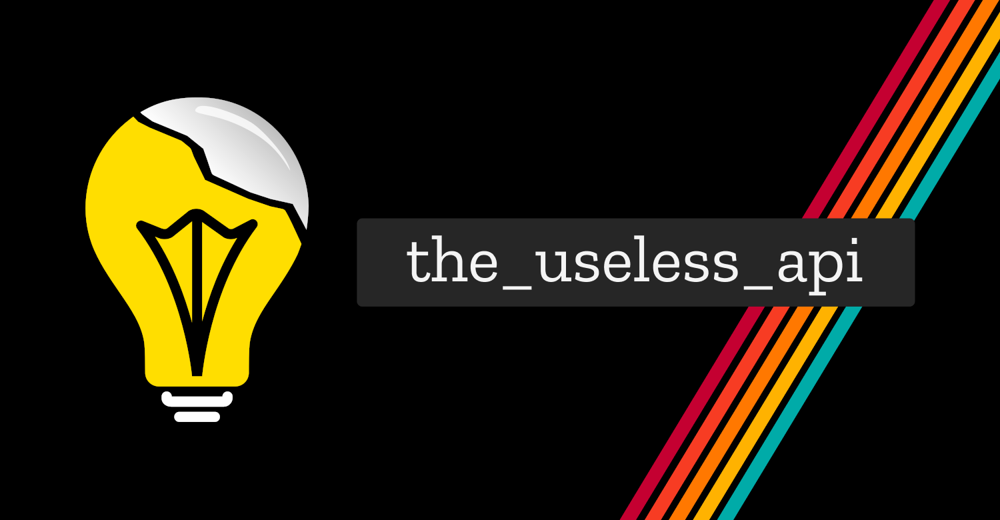

## the_useless_api



An api that gives you useless facts, use any way you see fit.

## Adding facts

All the facts are in the `./utils/facts.js` and feel free to add more facts and make a PR, if you feel like you need a category they are in `./utils/categories.js`.

## Running locally

This website and API uses `Next.js` and `tailwind`. You can start it by cloning and then running:

```sh
yarn
yarn dev
```

### License

MIT
